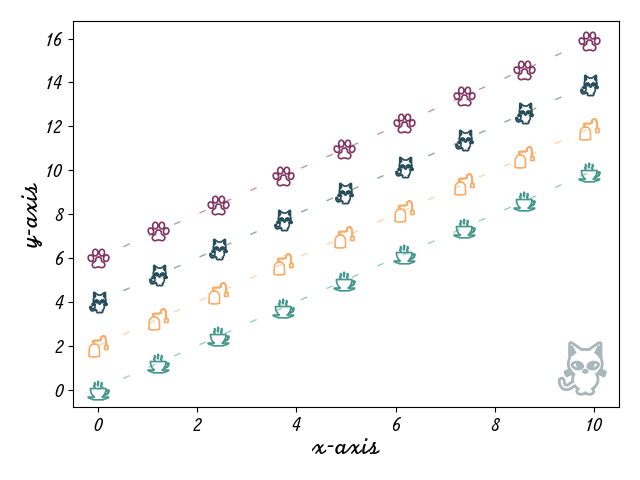

# Taraplotlib

A cosy matplotlib styles for tea and cat lovers, inspired by the one and only [Tara Murphy](https://murphytarra.wixsite.com/tara-murphy-website), part-time science communicator and professional tea drinker.

`taraplotlib` (aka `tpl`) is a quirky little thing that tries to recreate in a plot the feeling of sipping a cup of warm tea in a rainy day.

How did we do it? Let's see some examples!

If we try to plot a line...

``` python
x = np.linspace(0, 10, 10)

fig, ax = plt.subplots()
ax.plot(x, x)
```


... a line of steaming hot teacups appears! And in a nice pastel color, non of that professional-looking default blue!

> Full example available in `taraplotlib/examples/single-line.py`

I wonder what happens if I try to plot multiple lines...?


> Full example available in `taraplotlib/examples/simple_plot.py`

More pastel colors! And more nice little silhouettes!  And we haven't even mentioned the cat in the background! That's a plot carrying one heck of a cosy vibe, right?

And to the purists in the room that have noticed, yes, by default `tpl` plots (cute) _markers_, not _lines_. "But what if I have too many data points? Won't the plot get too crowded?", I hear you ask. And to you - you know who you are - I reply that the issue is that you have _too many_ data points. This is a __cosy__ plotting library, and you are working too hard! Stop producing so much data and go enjoy a cup of tea and maybe a movie!

However, if you still insist in having _so much_ data to be plotted, the usual `matplotlib` incantations are available to restore your precious lines.
But please don't forget to 

```python
add_background(ax, 'cat')
```

or your favorite between the available images (`cat`, `teacup`, `teabag`, `pawprint`), to save at least _some_ of the good vibes!

Ok, now imagine that you have a 2D dataset to plot. Let's see what happens...


> Full example available in `taraplotlib/examples/2d_plot.py`

... what a cosy colormap! None of that harsh purple and yellow in `viridis`. 

But... does that mean `tpl` has it's own colormaps? Yes! Here they are in their full glory!


> Code available in `taraplotlib/examples/colormaps.py`

So, if you are convinced, please don't hesitate to join in the cosy fun of `tpl` with a simple

``` bash
pip install .
```
